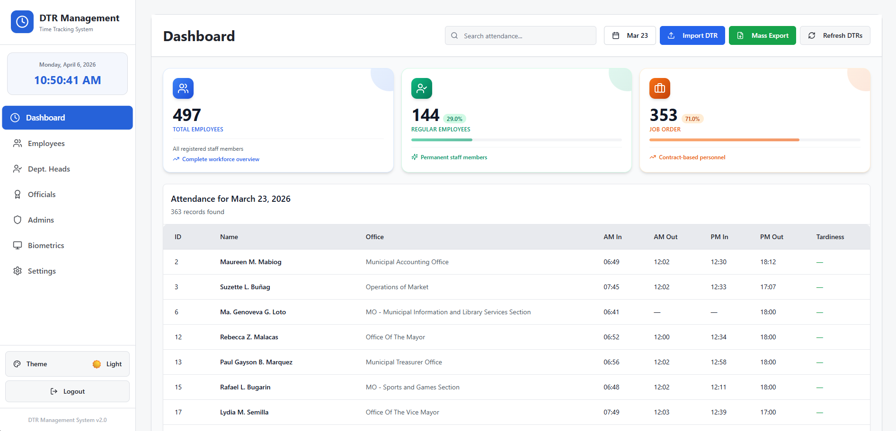
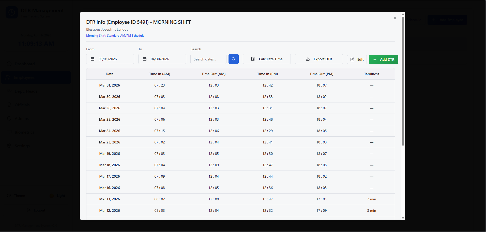
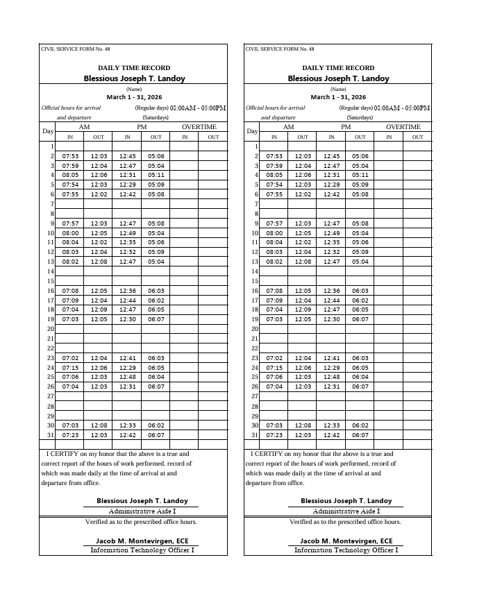
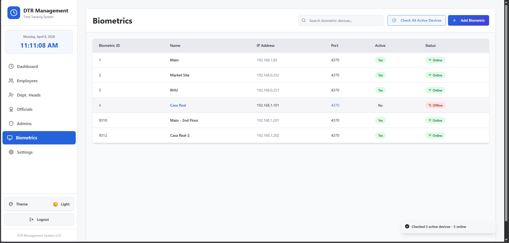

# MuniWeb - DTR Management System

For instructions on how to set up and run this project on another computer, please refer to the **[RUNNING_GUIDE.md](./RUNNING_GUIDE.md)**.

## Quick Start
1. Install Node.js, Python, and MySQL.
2. Import `database.sql`.
3. Run `npm install` and `pip install -r requirements.txt`.
4. Run `run.bat`.

## Screenshots
Below are screenshots of the application useful for portfolio/job-application purposes.

- Dashboard / Attendance overview

	

- Edit Employee modal

	

- DTR Info modal (employee DTR records)

	

- Printable DTR (PDF preview)

	

- Biometrics devices list

	

- Mass Print DTR modal

	
