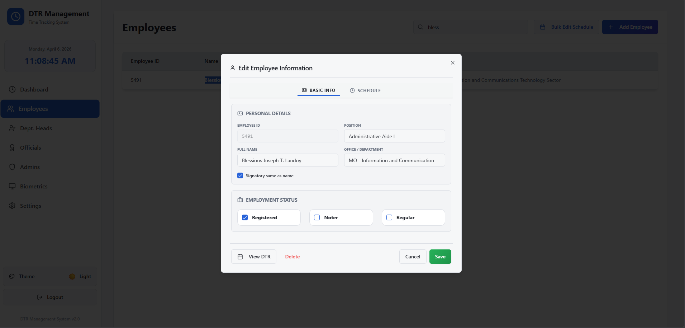
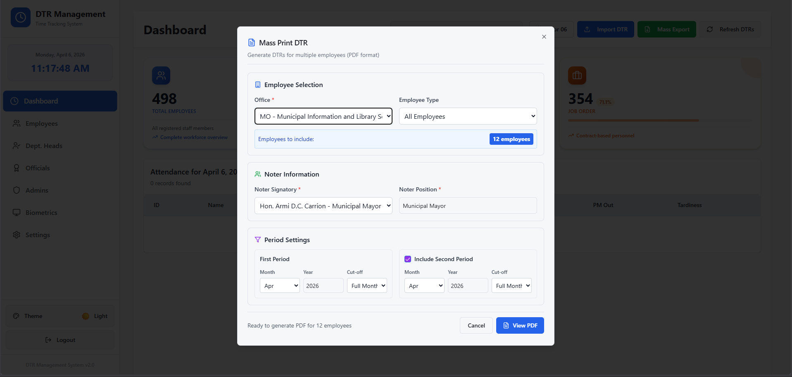

# MuniWeb - DTR Management System

A comprehensive Daily Time Record (DTR) management system for municipal employees with integrated biometric device support. Built with Python FastAPI and Next.js, this application provides an intuitive interface for tracking employee attendance, managing DTR records, and generating comprehensive reports.

## ✨ Features
- **Employee Management** - Create, read, update, and delete employee records with department assignments
- **Biometric Integration** - Support for fingerprint/time clock devices for automated attendance tracking
- **DTR Tracking** - View, edit, and manage daily time records with tardiness calculations
- **Dashboard Analytics** - Real-time attendance statistics, tardiness summaries, and employee insights
- **Export Capabilities** - Generate Excel and PDF exports for DTR records and reports
- **Authentication & Authorization** - Secure user login with role-based access control
- **Responsive UI** - Modern, user-friendly interface built with Next.js and React

## 🛠 Tech Stack
- **Backend:** Python FastAPI (async, high-performance REST API)
- **Frontend:** Next.js 14 + React + TypeScript
- **Database:** MySQL
- **Styling:** Tailwind CSS
- **Biometric Library:** PyZK for device communication

## 📋 Screenshots
Below are screenshots of the application useful for portfolio/job-application purposes.

- Dashboard / Attendance overview

	

- Edit Employee modal

	

- DTR Info modal (employee DTR records)

	

- Printable DTR (PDF preview)

	

- Biometrics devices list

	

- Mass Print DTR modal

	

## 🚀 Quick Start
For detailed instructions on how to set up and run this project on another computer, please refer to the **[RUNNING_GUIDE.md](./RUNNING_GUIDE.md)**.

1. Install Node.js, Python, and MySQL.
2. Run `npm run sanitize:sql`, then import `database.deployment.sql`.
3. Run `npm install` and `pip install -r requirements.txt`.
4. Run `run.bat`.
